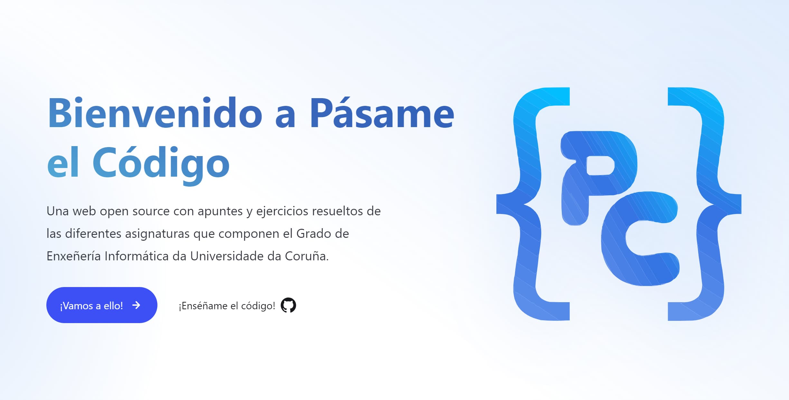

[](https://pc.pablopl.dev)

<div align="center">


[](https://astro.build/)
[](https://vercel.com)
[](https://www.oracle.com/es/java/)
[](https://en.wikipedia.org/wiki/C_(programming_language))
[](https://ocaml.org/)
[](https://www.oracle.com/es/java/)
[](https://pc.pablopl.dev)
[](https://github.com/TeenBiscuits/Pasame-Codigo/pulls)
[](https://github.com/TeenBiscuits/Pasame-Codigo/graphs/contributors)
[](https://github.com/TeenBiscuits/Pasame-Codigo)

</div>

<div align="center">
<br/>
<b>Pásame el Código</b> es una web open source con apuntes y ejercicios resueltos de las diferentes asignaturas que componen el Grado de <b>Enxeñería Informática da Universidade da Coruña</b>.
<br/>
</div>

## Contribuye

> [!IMPORTANT]  
> Este proyecto esta bajo desarrollo activo. Se aceptan contribuciones y se mejorará la experiencia para contribuir.

<!--
Repobeats - Stats https://repobeats.axiom.co
<div align="center">
<a href="https://github.com/TeenBiscuits/Pasame-Codigo/pulse"></a>
</div>
-->

## Estrellitas 🌟

<div align="center">
    <a href="https://star-history.com/#TeenBiscuits/Pasame-Codigo&Date">
    <picture>
    <source media="(prefers-color-scheme: dark)" srcset="https://api.star-history.com/svg?repos=TeenBiscuits/Pasame-Codigo&type=Date&theme=dark" />
    <source media="(prefers-color-scheme: light)" srcset="https://api.star-history.com/svg?repos=TeenBiscuits/Pasame-Codigo&type=Date" />
    
    </picture>
    </a>
</div>

## Licencias

<p xmlns:cc="http://creativecommons.org/ns#" xmlns:dct="http://purl.org/dc/terms/"><a property="dct:title" rel="cc:attributionURL" href="https://pc.pablopl.dev/">Pásame el Código</a>* por <a rel="cc:attributionURL dct:creator" property="cc:attributionName" href="https://github.com/TeenBiscuits">Pablo Portas López</a> esta licenciado bajo <a href="https://creativecommons.org/licenses/by-nc/4.0/?ref=chooser-v1" target="_blank" rel="license noopener noreferrer" style="display:inline-block;">CC BY-NC 4.0</a></p>

\* Esto aplica a apuntes, tutoriales, logos y otros materiales que sean distribuidos en la web y este repositorio bajo la contribución de cualquiera siempre que no se especifique lo contrario por el autor.

Esto **no aplica** a todo el código publicado en la web, cada 'archivo' ha sido correctamente etiquetado con la licencia bajo la que es compartido. Por otra parte el código, propio, de la página web es distribuido bajo una licencia **GNU GPLv3**.

Puede encontrar una copia de todas las licencias pertinentes en la carpeta [LICENSES](./LICENSES).

<div align="center">

```bash
// Made with love by Pablo Portas López
```

</div>

