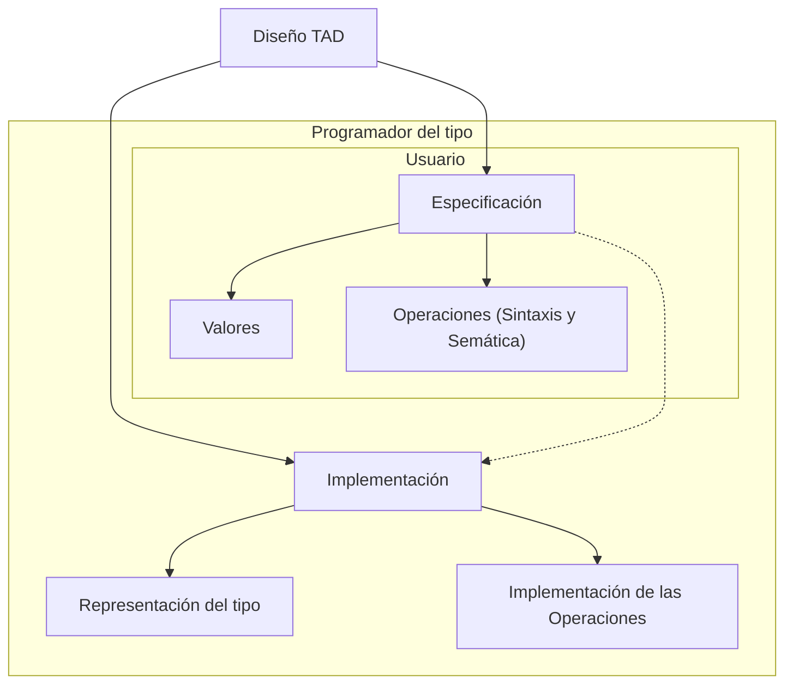

import Mermaid from "@components/Mermaid.astro";
import { Code, Steps } from '@astrojs/starlight/components';
import { ShowcaseProfile } from 'starlight-showcases';

:::note

>Los estudiantes deben convercerse de que la programación no un arte misterioso, sino una disciplina ingenieril...
>
>... la abstracción y la especificación deben ser piezas clave para conseguir una programación efectiva.

- **Barbara Liskov**: Profesora en el Massachusetts Institute of Technology (MIT); Medalla John von Neumann, 2004; Premio Turing, 2008; Computer Pioneer Award de la IEEE Computer Society, 2018.

- **John Guttag**: Profesor en el Massachusetts Institute of Technology (MIT).

:::

## ¿Qué es la abstracción?

<Steps>

1. tr. Separar por medio de una operación intelectual un rasgo o una cualidad de algo para analizarlos aisladamente o
considerarlos en su pura esencia o noción.


2. intr. Hacer caso omiso de algo, o dejarlo a un lado.

</Steps>

:::tip
Si la definición de la RAE te ha dejado igual que como estabas. No te preocupes.
:::

La abstracción, entendiéndola como su primera acepción **es fundamental** tanto en la programación como en cualquier
disciplina intelectual.

_Gracias al pensamiento abstracto el avance tecnológico/científico humano no parece tener
límite._

Un ejemplo sencillo, un conductor **no necesita** conocer el complicado mecanismo que permite a su coche cambiar las
marchas (ni siquiera que son las marchas) del motor. **Lo único que debe entender es una implementación (abstracción)**
"sencilla" como es el embrague y la palanca de cambios y **como interactuar** con ella.

En el ámbito de la programación la abstracción es **constante**. Cuando programamos en C, **no necesitamos** conocer
como ha sido **implementada** la función ```printf()```, solo debemos conocer **como interactuar** con ella, el formato
que acepta que puede o no leer, etc.

:::note

Sí te pica la curiosidad, la función ```printf()``` tiene más de **700 líneas de código**, si quieres curiosear una de
sus
implementaciones. [Enlace a "printf.c" de coreutils](https://github.com/coreutils/coreutils/blob/master/src/printf.c)

:::

En este tema nos centraremos en los **TAD**s los **Tipos Abstractos de Datos**, un tipo de abstracción común y que en el
futuro nos resultará muy util.

## Definición de Tipo Abstracto de Datos

:::note

Un tipo abstracto de datos es aquel **definido por el programador** que puede ser manipulado de forma **similar** a los
**definidos por el sistema**.

Al igual que estos últimos, un tipo abstracto de datos corresponde a un **conjunto de valores** lícitos y de *
*operaciones** asociadas a los mismos, operaciones que se definen mediante una **especificación** que es **independiente
de la implementación** de esos datos.

**John Guttag (1974)**

:::

A la hora de definir un TAD, debemos seguir unas pautas formales, para obtener la abstracción que **facilita el
desarrollo** a otros/as programadores/as como nosotros/as.

<Mermaid>

</Mermaid>

## Especificación de un TAD

```
Nombre_de_operación (tipo_de_argumento) -> tipo_de_resultado
```

| TAD            | Nombre_del_tipo                                                                     |
|----------------|-------------------------------------------------------------------------------------|
| VALORES        | valores que pueden tomar los datos del tipo                                         |
| OPERACIONES    | nombre de las operaciones que los manipulan                                         |
| Objetivo       | Descripción de la operación                                                         |
| Entrada        | Descripción los datos de entrada                                                    |
| Salida         | Que se espera como retorno en invocación                                            |
| Precondiciones | Que condiciones se esperan de los datos de entrada                                  |
| Poscondiciones | Que efectos laterales puede tener invocar la función (Que modifica, que añade, etc) |

Podemos clasificarlas en:

- Constructoras: Devuelven el TAD
    - Generadoras: Solo ellas pueden generar el TAD
    - Modificadoras: El resto
- Observadoras / Acceso: No devuelve un TAD
- Destructoras: Devuelven el TAD

## Ejemplo de especificación de un TAD: Rational

Vamos a crear un TAD para los números racionales, es decir, un par de números enteros: Numerador y denominador

$
\frac{Numerador}{Denominador}
$

**Constructoras Generadoras**

- $CreateRational (Entero_{1}, Entero_{2}) \rightarrow Rational$

  Objetivo: Crea un número racional.

  Entrada: Numerador del nuevo racional y denominador del nuevo racional.

  Precondición: Denominador distinto de 0.

  Salida: El número racional creado.

**Constructoras Modificadoras**

- $Sum (Rational_{1}, Rational_{2}) \rightarrow Rational_{3}$

  Objetivo: Calcula la suma de dos números racionales.

  Entrada: Números racionales a sumar.

  Salida: Un nuevo racional suma de los números a la entrada.

**Observadoras**

- $Numerator (Rational) \rightarrow Entero$

  Objetivo: Obtiene el numerador de un número racional.

  Entrada: Número racional del que obtener el numerador.

  Salida: Numerador del número a la entrada.

- $Denominator (Rational) \rightarrow Entero$

  Objetivo: Obtiene el denominador de un número racional.

  Entrada: Número racional del que obtener el denominador.

  Salida: Denominador del número a la entrada.

### Rational TAD: El código

import RationalMain from '@ejemplos/TAD_Rational/main.c?raw';
import RationalPointerC from '@ejemplos/TAD_Rational/rational_pointer.c?raw';
import RationalPointerH from '@ejemplos/TAD_Rational/rational_pointer.h?raw';
import RationalStructC from '@ejemplos/TAD_Rational/rational_struct.c?raw';
import RationalStructH from '@ejemplos/TAD_Rational/rational_struct.h?raw';
import RationalCMakeList from '@ejemplos/TAD_Rational/CMakeLists.txt?raw';

<details>
<summary>Implementación</summary>
<Code code={RationalMain} lang='c' title="main.c"/>
<Code code={RationalPointerC} lang='c' title="rational_pointer.c"/>
<Code code={RationalPointerH} lang='c' title="rational_pointer.h"/>
<Code code={RationalStructC} lang='c' title="rational_struct.c"/>
<Code code={RationalStructH} lang='c' title="rational_struct.h"/>
<Code code={RationalCMakeList} lang='cmake' title="CMakeLists.txt"/>
</details>

<ShowcaseProfile
  entries={[
    {
      name: 'Pablo Portas López',
      picture: 'https://avatars.githubusercontent.com/u/81629707?v=4',
      href: 'https://github.com/TeenBiscuits',
      description:
        "Copyright © 2024",
    },
  ]}
/>
