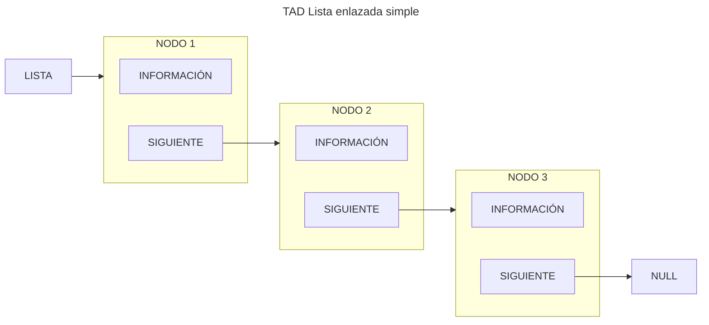
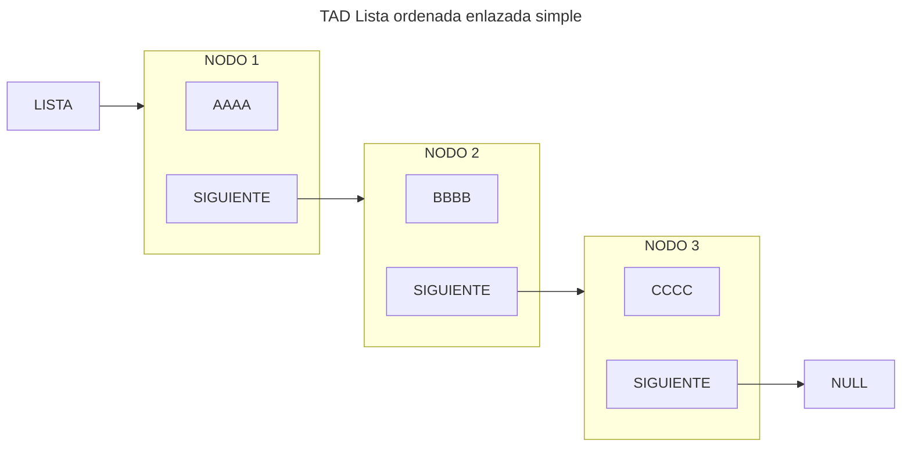

import Mermaid from "@components/Mermaid.astro";
import { ShowcaseProfile } from 'starlight-showcases';

> El TAD Lista, especificación informal, implementación y descripción gráfica. Operaciones explicadas de forma gráfica e implementadas. Otros tipos de TAD como Lista Ordenada y Multilistas también explicados.

## TAD Lista

:::note

Esto es una especificación informal del TAD

:::

Una lista es por definición un conjunto de cero o más elementos.

Los elementos están ordenados de forma lineal, no por su contenido, sino simplemente por la posición que ocupan
relativos unos a otros.

<Mermaid>

</Mermaid>

Por lo tanto, la lista está formada por ``nodos`` idénticos. Cada nodo está formado por dos elementos, la información
del propio nodo y un puntero que apunta al siguiente. Además, el inicio de la lista está delimitado por un
puntero ``Lista``, y finaliza con el último nodo que apunta a ``NULL``.

### Operaciones

Siguiendo los pasos para la especificación de un TAD, definimos las operaciones del mismo clasificándolas en:
constructoras, generadoras, modificadoras, observadoras y destructoras.

:::note

Para más información: [Especificación de un TAD](/prodos/apuntes/t1-tipos-abstractos-de-datos-tad/#especificaci%C3%B3n-de-un-tad)

:::

#### Generadoras

- $createEmptyList \rightarrow List$

    Objetivo: Crear una lista vacía y la inicializa

    Salida: Una lista vacía
    
    Poscondición: La lista sin datos

<Mermaid>
```mermaid
flowchart LR
    LISTA --&gt; NULL
```
</Mermaid>

<details>
<summary>Mostrar implementación</summary>
```c title="createEmptyList.c"
// SPDX-FileCopyrightText: 2024 Eliana Reigada
//
// SPDX-License-Identifier: GPL-3.0-only

void createEmptyList(tList *lista) {
    lista->indice = LNULL;
}
```
</details>

$insertItem (Item, Position, List) \rightarrow List, Boolean$

Objetivo: Si la posición es nula, añade un elemento al final de la lista. En caso contrario, el elemento quedará
insertado justo antes del que actualmente ocupa la posición indicada.

Entrada:

- Item: Contenido del elemento a insertar
- Position: Posición de referencia para la inserción
- List: Lista donde vamos a insertar

Salida: List: Lista con el elemento Item insertado y verdadero si se ha podido insertar, falso en caso contrario

Precondición: Position es una posición válida de la lista o es una posición nula

Postcondición: Las posiciones de los elementos de la lista posteriores a la del elemento insertado pueden haber variado


<Mermaid>
```mermaid
flowchart LR
    LISTA
    subgraph NODO1[NODO 1]
        CONTENIDO1[INFORMACIÓN]
        SIGUIENTE1[SIGUIENTE]
    end
    subgraph NODO3[NODO 2]
        CONTENIDO3[INFORMACIÓN]
        SIGUIENTE3[SIGUIENTE]
    end
    LISTA --&gt; NODO1
    SIGUIENTE1 --&gt; NODO3
    SIGUIENTE3 --&gt; NULL
```
</Mermaid>
<Mermaid>
```mermaid
flowchart LR
    LISTA
    subgraph NODO1[NODO 1]
        CONTENIDO1[INFORMACIÓN]
        SIGUIENTE1[SIGUIENTE]
    end
    subgraph NODO2[NUEVO NODO]
        CONTENIDO2[INFORMACIÓN]
        SIGUIENTE2[SIGUIENTE]
    end
    subgraph NODO3[NODO 2]
        CONTENIDO3[INFORMACIÓN]
        SIGUIENTE3[SIGUIENTE]
    end
    LISTA --&gt; NODO1
    SIGUIENTE1 -.-&gt; NODO2
    SIGUIENTE2 -.-&gt; NODO3
    SIGUIENTE3 --&gt; NULL
```
</Mermaid>

<details>
<summary>Mostrar implementación</summary>
```c title="insertItem.c"
// SPDX-FileCopyrightText: 2023 Fernando Álvarez
//
// SPDX-License-Identifier: GPL-3.0-only

bool insertItem(tItemL item, tPosL pos, tList *lista) {

    tPosL posAux;
    if (!createNode(&posAux)) {

        return false;

    } else {

        posAux->data = item;
        posAux->next = LNULL; //por si acaso
    }
    if (isEmptyList(*lista)) {

        *lista = posAux;
    } else if (pos == LNULL) {

        last(*lista)->next = posAux;

    } else if (pos == *lista) {

        posAux->next = pos;
        *lista = posAux;

    } else {

        posAux->next = pos->next;
        pos->next = posAux;
        posAux->data = pos->data;
        pos->data = item;
    }
    return true;
}
```
</details>

### Modificadores

$copyList(List_1) \rightarrow List_2, Boolean$

Objetivo: Copia una lista en otra

Entrada: List_1: Lista que vamos a copiar

Salida: List_2: Copia de la lista original y verdadero si se ha podido copiar, falso en caso contrario

Precondición: La lista origen está inicializada

<Mermaid>
```mermaid
flowchart LR
    LISTA1[LISTA 1] --&gt; NODO1 --&gt; NODO2 --&gt; NULL
    LISTA2[LISTA 2]
```
</Mermaid>
<Mermaid>
```mermaid
flowchart LR
    LISTA1[LISTA 1] --&gt; NODO1[NODO 1] --&gt; NODO2[NODO 2] --&gt; NULL
    LISTA2[LISTA 2] --&gt; NODO21[NUEVO NODO]
    LISTA2 -. X .-&gt; NODO1[NODO 1]
```
</Mermaid>
<Mermaid>
```mermaid
flowchart LR
    LISTA1[LISTA 1] --&gt; NODO1[NODO 1] --&gt; NODO2[NODO 2] --&gt; NULL
    LISTA2[LISTA 2] --&gt; NODO21[NODO 1]
    NODO1 == copiar ==&gt; NODO21[NODO 1]
```
</Mermaid>
<Mermaid>
```mermaid
flowchart LR
    LISTA1[LISTA 1] --&gt; NODO1[NODO 1] --&gt; NODO2[NODO 2] --&gt; NULL
    LISTA2[LISTA 2] --&gt; NODO21[NODO 1] --&gt; NODO22[NUEVO NODO]
    NODO2 == copiar ==&gt; NODO22[NUEVO NODO]
```
</Mermaid>
<Mermaid>
```mermaid
flowchart LR
    LISTA1[LISTA 1] --&gt; NODO1[NODO 1] --&gt; NODO2[NODO 2] --&gt; NULL
    LISTA2[LISTA 2] --&gt; NODO21[NODO 1] --&gt; NODO22[NODO 2] --&gt; NULL
```
</Mermaid>

<details>
<summary>Mostrar implementación</summary>
```c title="copyList.c"
// SPDX-FileCopyrightText: 2024 Eliana Reigada
//
// SPDX-License-Identifier: GPL-3.0-only

bool copyList(tlist listaDest, tList *listaOrig) {
    tPosl p, q, r;
    bool ret = true;

    createEmptyList(listaOrig);
    if (!isEmptyList(listaDest)) {
        p = listaDest;
        while ((p != LNULL) && createNode(&r)) {
            r->data = p->data;
            r->next = LNULL;
            if (p == listaDest) {
                *listaOrig = r;
                q = r;
            } else {
                q->next = r;
                q = r;
            }
            p = p->next;
        }
        if (p != LNULL) {
            deleteList(listaOrig);
            ret = false;
        }
    }
    return ret;
}
```
</details>

$updateItem (Item, Position, List) \rightarrow List$


Objetivo: Modifica el contenido de un elemento de la lista

Entrada:

- Item: Nuevo contenido a asignar al elemento en Position
- Position: Posición del elemento que queremos modificar
- List: Lista a modificar

Salida: List: Lista con el contenido del elemento modificado

Precondición: Position es una posición válida de la lista

<Mermaid>
```mermaid
flowchart LR
    LISTA
    subgraph NODO1[NODO 1]
        CONTENIDO1[INFORMACIÓN]
        SIGUIENTE1[SIGUIENTE]
    end
    subgraph NODO2[NODO A MODIFICAR]
        CONTENIDO2[INFORMACIÓN ANTIGUA]
        SIGUIENTE2[SIGUIENTE]
    end
    subgraph NODO3[NODO 2]
        CONTENIDO3[INFORMACIÓN]
        SIGUIENTE3[SIGUIENTE]
    end
    subgraph MOD[_]
        INFO[NUEVA INFORMACIÓN]
        POS[POSICIÓN A MODIFICAR]
    end
    LISTA --&gt; NODO1
    SIGUIENTE1 --&gt; NODO2
    SIGUIENTE2 --&gt; NODO3
    SIGUIENTE3 --&gt; NULL
    INFO -.-&gt; CONTENIDO3
    POS --&gt; NODO3
```
</Mermaid>

<details>
<summary>Mostrar implementación</summary>
```c title="updateItem.c"
// SPDX-FileCopyrightText: 2024 Eliana Reigada
//
// SPDX-License-Identifier: GPL-3.0-only

void updateItem(tItem item, tPosL pos, tList *lista) {
    pos->data = item;
}
```
</details>

### Destructoras

$deleteAtPosition(Position, List) \rightarrow List$

Objetivo: Elimina de la lista un elemento con cierta posición

Entrada:

Position: Posición del elemento a eliminar

List: Lista a modificar

Salida: List: Lista sin el elemento correspondiente a Position

Precondición: Position es una posición válida de la lista

Postcondición: Las posiciones de los elementos de la lista posteriores a la de la posición eliminada pueden haber variado

<Mermaid>
```mermaid
flowchart TB
    LISTA
    subgraph NODO1[NODO 1]
        CONTENIDO1[INFORMACIÓN]
        SIGUIENTE1[SIGUIENTE]
    end
    subgraph NODO2[NODO A ELIMINAR]
        CONTENIDO2[INFORMACIÓN]
        SIGUIENTE2[SIGUIENTE]
    end
    subgraph NODO3[NODO 2]
        CONTENIDO3[INFORMACIÓN]
        SIGUIENTE3[SIGUIENTE]
    end
    LISTA --&gt; NODO1
    SIGUIENTE1 -.-&gt; NODO2
    SIGUIENTE1 --&gt; NODO3
    SIGUIENTE2 -.-&gt; NODO3
    SIGUIENTE3 --&gt; NULL
```
</Mermaid>
<Mermaid>
```mermaid
flowchart TB
    LISTA
    subgraph NODO1[NODO 1]
        CONTENIDO1[INFORMACIÓN]
        SIGUIENTE1[SIGUIENTE]
    end
    subgraph NODO3[NODO 2]
        CONTENIDO3[INFORMACIÓN]
        SIGUIENTE3[SIGUIENTE]
    end
    LISTA --&gt; NODO1
    SIGUIENTE1 --&gt; NODO3
    SIGUIENTE3 --&gt; NULL
```
</Mermaid>

<details>
<summary>Mostrar implementación</summary>
```c title="deleteAtPosition.c"
// SPDX-FileCopyrightText: 2024 Eliana Reigada
//
// SPDX-License-Identifier: GPL-3.0-only

void deleteAtPosition(tPosL pos, tList *lista) {
    tPosl posAux;

    if (pos == *lista)
        *lista = (*lista)->next;
    else {
        for (posAux = *lista; posAux->next != pos; posAux = posAux->next);
        posAux->next = pos->next;
    }

    free(pos);
}
```
</details>

$deleteList (List) \rightarrow List$

Objetivo: Elimina todos los elementos de la lista

Entrada: List: Lista a borrar

Salida: Lista vacía

<Mermaid>
```mermaid
flowchart TB
    LISTA
    subgraph NODO1[NODO 1]
        CONTENIDO1[INFORMACIÓN]
        SIGUIENTE1[SIGUIENTE]
    end
    subgraph NODO2[NODO 2]
        CONTENIDO2[INFORMACIÓN]
        SIGUIENTE2[SIGUIENTE]
    end
    subgraph NODO3[NODO 3]
        CONTENIDO3[INFORMACIÓN]
        SIGUIENTE3[SIGUIENTE]
    end
    LISTA --&gt; NODO1
    SIGUIENTE1 --&gt; NODO2
    SIGUIENTE2 --&gt; NODO3
    SIGUIENTE3 -.-&gt; NULL
    DELETE["FREE ()"] ==&gt; NODO3
```
</Mermaid>
<Mermaid>
```mermaid
flowchart TB
    LISTA
    subgraph NODO1[NODO 1]
        CONTENIDO1[INFORMACIÓN]
        SIGUIENTE1[SIGUIENTE]
    end
    subgraph NODO2[NODO 2]
        CONTENIDO2[INFORMACIÓN]
        SIGUIENTE2[SIGUIENTE]
    end
    LISTA --&gt; NODO1
    SIGUIENTE1 --&gt; NODO2
    SIGUIENTE2 -.-&gt; NODO3[ANTIGUA DIRECCIÓN DE NODO 3]
    NULL
    DELETE["FREE ()"] ==&gt; NODO2
```
</Mermaid>
<Mermaid>
```mermaid
flowchart TB
    LISTA
    subgraph NODO1[NODO 1]
        CONTENIDO1[INFORMACIÓN]
        SIGUIENTE1[SIGUIENTE]
    end
    LISTA --&gt; NODO1
    SIGUIENTE1 -.-&gt; NODO2[ANTIGUA DIRECCIÓN DE NODO 2]
    NULL
    DELETE["FREE ()"] ==&gt; NODO1
```
</Mermaid>
<Mermaid>
```mermaid
flowchart LR
    LISTA --&gt; NULL
```
</Mermaid>

<details>
<summary>Mostrar implementación</summary>
```c title="deleteList.c"
// SPDX-FileCopyrightText: 2024 Eliana Reigada
//
// SPDX-License-Identifier: GPL-3.0-only

void deleteList(tList *lista) {
    tPosL posAux;
    while (*lista != LNULL) {
        while (posAux->next != NULL)
            posAux = posAux->next;
        free(posAux);
    }
}
```
</details>

#### Observadoras


$findItem (Item, List) \rightarrow Position$

Objetivo: Busca el primer elemento con cierto contenido en la lista

Entrada:

- Item: Contenido del elemento buscado
- List: Lista donde realizar la búsqueda
Salida: Position: Posición del elemento encontrado o nulo si no se encuentra

<Mermaid>
```mermaid
flowchart TB
    LISTA
    subgraph NODO1[NODO 1]
        CONTENIDO1[USUARIO 1]
        SIGUIENTE1[SIGUIENTE]
    end
    subgraph NODO2[NODO 2]
        CONTENIDO2[USUARIO 2]
        SIGUIENTE2[SIGUIENTE]
    end
    subgraph NODO3[NODO 3]
        CONTENIDO3[USUARIO 3]
        SIGUIENTE3[SIGUIENTE]
    end
    LISTA --&gt; NODO1
    SIGUIENTE1 --&gt; NODO2
    SIGUIENTE2 --&gt; NODO3
    SIGUIENTE3 --&gt; NULL
    FIND["¿ERES EL USUARIO3?"] -- NO --&gt; NODO1
```
</Mermaid>
<Mermaid>
```mermaid
flowchart TB
    LISTA
    subgraph NODO1[NODO 1]
        CONTENIDO1[USUARIO 1]
        SIGUIENTE1[SIGUIENTE]
    end
    subgraph NODO2[NODO 2]
        CONTENIDO2[USUARIO 2]
        SIGUIENTE2[SIGUIENTE]
    end
    subgraph NODO3[NODO 3]
        CONTENIDO3[USUARIO 3]
        SIGUIENTE3[SIGUIENTE]
    end
    LISTA --&gt; NODO1
    SIGUIENTE1 --&gt; NODO2
    SIGUIENTE2 --&gt; NODO3
    SIGUIENTE3 --&gt; NULL
    FIND["¿ERES EL USUARIO3?"] -- NO --&gt; NODO2
```
</Mermaid>
<Mermaid>
```mermaid
flowchart TB
    LISTA
    subgraph NODO1[NODO 1]
        CONTENIDO1[USUARIO 1]
        SIGUIENTE1[SIGUIENTE]
    end
    subgraph NODO2[NODO 2]
        CONTENIDO2[USUARIO 2]
        SIGUIENTE2[SIGUIENTE]
    end
    subgraph NODO3[NODO 3]
        CONTENIDO3[USUARIO 3]
        SIGUIENTE3[SIGUIENTE]
    end
    LISTA --&gt; NODO1
    SIGUIENTE1 --&gt; NODO2
    SIGUIENTE2 --&gt; NODO3
    SIGUIENTE3 --&gt; NULL
    FIND["¿ERES EL USUARIO3?"] -- SI --&gt; NODO3
```
</Mermaid>

<details>
<summary>Mostrar implementación</summary>
```c title="findItem.c"
// SPDX-FileCopyrightText: 2024 Eliana Reigada
//
// SPDX-License-Identifier: GPL-3.0-only

tPosL findItem(tItem item, tList lista) {
    tPosL posAux;
    for (posAux = lista; (posAux != LNULL) && (posAux->data != item); posAux = posAux->next);
    return posAux;
}
```
</details>

$isEmptyList (List) \rightarrow Boolean$


Objetivo: Determina si la lista está vacía

Entrada: List: Lista a comprobar

Salida: Verdadero si la lista está vacía, falso en caso contrario

<details>
<summary>Mostrar implementación</summary>
```c title="isEmptyList.c"
// SPDX-FileCopyrightText: 2024 Eliana Reigada
//
// SPDX-License-Identifier: GPL-3.0-only

bool isEmptyList(tLIst lista) {
    return lista == LNULL;
}
```
</details>

$getItem (Position, List) \rightarrow Item$

Objetivo: Recupera el contenido de un elemento de la lista

Entrada: Position: Posición del elemento buscado

List: Lista donde realizar la búsqueda

Salida: Item: Contenido del elemento que está en Position

Precondición: Position es una posición válida en la lista

<details>
<summary>Mostrar implementación</summary>
```c title="getItem.c"
// SPDX-FileCopyrightText: 2024 Eliana Reigada
//
// SPDX-License-Identifier: GPL-3.0-only

tItem getItem(tPosL pos, tList lista) {
    return pos->data;
}
```
</details>

$first (List) \rightarrow Position$

Objetivo: Devuelve la posición del primer elemento de la lista

Entrada: List: Lista a manipular

Salida: Position: Posición del primer elemento

Precondición: La lista no está vacía

<details>
<summary>Mostrar implementación</summary>
```c title="first.c"
// SPDX-FileCopyrightText: 2024 Eliana Reigada
//
// SPDX-License-Identifier: GPL-3.0-only

tPosL first(tList lista) {
    return lista;
}
```
</details>

$last (List) \rightarrow Position$

Objetivo: Devuelve la posición del último elemento de la lista

Entrada: List: Lista a manipular

Salida: Position: Posición del último elemento

Precondición: La lista no está vacía

<details>
<summary>Mostrar implementación</summary>
```c title="last.c"
// SPDX-FileCopyrightText: 2024 Eliana Reigada
//
// SPDX-License-Identifier: GPL-3.0-only

tPosL last(tList lista) {
    tPosL posAux;
    for (posAux = lista; posAux->next != LNULL; posAux->next);
    return posAux;
}
```
</details>

$previous (Position, List) \rightarrow Position$

Objetivo: Devuelve la posición del elemento anterior al actual

Entrada: Position: Posición del elemento actual

List: Lista a manipular

Salida: Posición del elemento anterior o nulo si es el primero

Precondición: Position es una posición válida de la lista

<details>
<summary>Mostrar implementación</summary>
```c title="previous.c"
// SPDX-FileCopyrightText: 2024 Eliana Reigada
//
// SPDX-License-Identifier: GPL-3.0-only

tPosL previous(tPosL pos, tList L) {
    tPosL posAux;
    for (posAux = L; posAux->next != pos; posAux = posAux->next);
    return posAux;
}
```
</details>

$next (Position, List) \rightarrow Position$

Objetivo: Devuelve la posición del elemento siguiente al actual

Entrada:

- Position: Posición del elemento actual
- List: Lista a manipular

Salida: Position: Posición del elemento siguiente o nulo si es el último

Precondición: Position es una posición válida de la lista

<details>
<summary>Mostrar implementación</summary>
```c title="next.c"
// SPDX-FileCopyrightText: 2024 Eliana Reigada
//
// SPDX-License-Identifier: GPL-3.0-only

tPosL next(tPosL pos, tList lista) {
    return pos->next;
}
```
</details>

## TAD Lista ordenada

:::note

Esto es una especificación informal del TAD

:::

Los elementos están ordenados de forma lineal por su contenido.

En caso de ordenación alfabética:

<Mermaid>

</Mermaid>

### Operación a cambiar

Las operaciones del TAD lista ordenada es idéntico al TAD anterior, la única a modificar es la operación de inserción:

$insertItem (Item, Position, List) \rightarrow List, Boolean$

Objetivo: Inserta un elemento en la lista según el criterio de ordenación sobre el campo Item

Entrada:

- Item: Contenido del elemento a insertar
- List: Lista donde vamos a insertar

Salida: List: Lista con el elemento Item insertado en la posición correspondiente según su contenido y verdadero si se
ha podido insertar, falso en caso contrario

Precondición: La lista está inicializada

Postcondición: Las posiciones de los elementos de la lista posteriores a la del elemento insertado pueden haber
variado

<Mermaid>
```mermaid
flowchart TB
    LISTA
    subgraph NODO1[NODO 1]
        CONTENIDO1[AAA]
        SIGUIENTE1[SIGUIENTE]
    end
    subgraph NODO2[NUEVO 2]
        CONTENIDO2[BBB]
        SIGUIENTE2[SIGUIENTE]
    end
    subgraph NODO3[NODO 3]
        CONTENIDO3[DDD]
        SIGUIENTE3[SIGUIENTE]
    end
    subgraph NODO4[NUEVO NODO]
        CONTENIDO4[CCC]
        SIGUIENTE4[SIGUIENTE]
    end
    LISTA --&gt; NODO1
    SIGUIENTE1 --&gt; NODO2
    SIGUIENTE2 --&gt; NODO3
    SIGUIENTE3 --&gt; NULL
```
</Mermaid>
<Mermaid>
```mermaid
flowchart TB
    LISTA
    subgraph NODO1[NODO 1]
        CONTENIDO1[AAA]
        SIGUIENTE1[SIGUIENTE]
    end
    subgraph NODO2[NUEVO 2]
        CONTENIDO2[BBB]
        SIGUIENTE2[SIGUIENTE]
    end
    subgraph NODO3[NODO 3]
        CONTENIDO3[DDD]
        SIGUIENTE3[SIGUIENTE]
    end
    subgraph NODO4[NUEVO NODO]
        CONTENIDO4[CCC]
        SIGUIENTE4[SIGUIENTE]
    end
    LISTA --&gt; NODO1
    SIGUIENTE1 --&gt; NODO2
    SIGUIENTE2 -.-&gt; NODO4
    SIGUIENTE4 -.-&gt; NODO3
    SIGUIENTE3 --&gt; NULL
```
</Mermaid>

<details>
<summary>Mostrar implementación</summary>
```c title="insertItem_Ordenada.c"

```
</details>

:::note

Al ser una lista ordenada, puede aprovecharse para volver más eficiente el algoritmo de búsqueda
de ``findItem(Item,List)``.

:::

## Comparación entre TADs


| |Estática|Simple Enlace|Doble Enlace|
|---|---|---|---|
|Necesidad de memoria|Mucha|Menos en promedio|Menos en promedio (+ que simple enlace)|
|Memoria contigua|✅|❌|❌|
|Acceso directo|✅|❌|❌|
|Ampliable|❌|✅|✅|
|Operaciones más costosas|insertItem, deleteAtPosition (excepto al final)|insertItem (final), deleteAtPosition (final), previous, last, deleteList, copyList|insertItem (final), last, deleteList, copyList|
|Seguridad|⚔️😡🛡️|😴🛡️|😴🛡️|


## Archivo de Cabecera TAD

```c
#include <stdbool.h>

#define LNULL ...; //Constante que representa posiciones nulas

// Se define en funcion del problema
typedef ... tItemL;
typedef ... tPosL;
typedef ... tList;

// Generadoras
void createEmptyList(tList* L);
bool insertItem(tItemL d, tPosL p, tList* L);

// Modificadoras
bool copyList(tList L, tList* M);
void updateItem(tItemL d , tPosL p, tList* L);

// Destructoras
void deleteAtPosition(tPosL p, tList* L);
void deleteList(tList* L);

// Observadoras
tPosL findItem(tItemL d, tList L);
bool isEmptyList(tList L);
tItemL getItem(tPosL p, tList L);
tPosL first(tList L) ;
tPosL last(tList L);
tPosL previous(tPosL p, tList L);
tPosL next(tPosL p, tList L);
```

## Multilistas

En problemas de programación reales hacen falta soluciones complejas. Es habitual combinar múltiples TAD simples para
construir un TAD complejo.

En este caso el TAD multilistas es un ejemplo de combinación de TADs, en este caso, listas.

### TAD Multilistas

La multilista consiste, en crear sublistas enlazadas a los nodos de una lista principal.

A una lista de usuarios podríamos enlazar, por ejemplo, una playlist para cada uno.


### TAD Multiordenadas

Esta lista multiordenada consta de dos punteros, uno apunta al primer nodo ordenada por nombre, y el otro al primer DNI.

Los están enlazados entre ellos doblemente. Marcando el nodo anterior y siguiente, en dos categorías: **Nombre** y **DNI**.


<ShowcaseProfile
  entries={[
    {
      name: 'Eliana Reigada',
      picture: 'https://avatars.githubusercontent.com/u/160122335?v=4',
      href: 'https://github.com/elianarl',
      description:
        "Código - Copyright © 2024",
    },
  ]}
/>
<ShowcaseProfile
  entries={[
    {
      name: 'Pablo Portas López',
      picture: 'https://avatars.githubusercontent.com/u/81629707?v=4',
      href: 'https://github.com/TeenBiscuits',
      description:
        "Apuntes - Copyright © 2024",
    },
  ]}
/>
